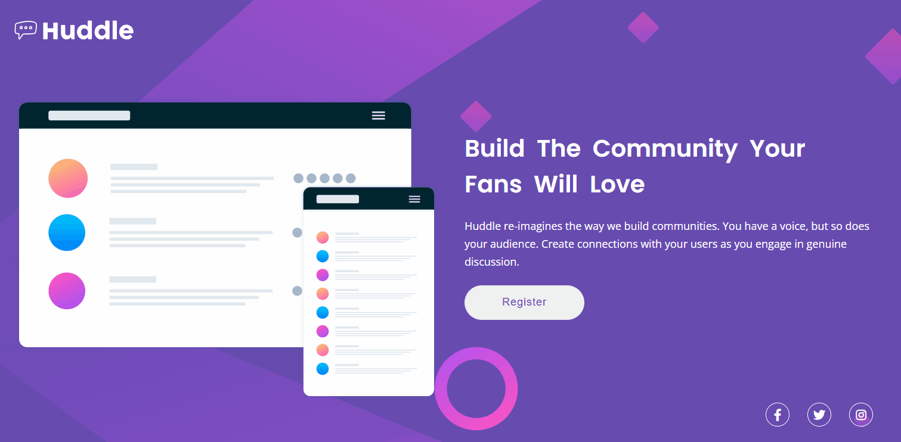

# Desafio Curso DevQuest🚀

Esse foi o primeiro desavio do curso devquest onde deveriamos utilizar o conceitos ensinados nos módulos de HTML e CSS

 

A partir de um desing, deveriamos reproduzir uma versao do site em Desktop e também Mobile.

 

## Gif da resolução do desafio Versão Desktop 1440px!
[]

 

- [Tecnologias utilizadas](#tecnologias-utilizadas)
- [O que eu aprendi](#o-que-eu-aprendi)
- [Dificuldades na elaboração](#dificuldades-na-elaboração)

## Tecnologias utilizadas

- HTML 
- CSS

### Dificuldades na elaboração: 
Um pouco de dificuldade no posicionamento dos elementos e também no desenvolvimentos do responsivo, seguimos em busca de aprimoramento.

## O que eu aprendi
Ajudou a fixar melhor os conceitos estudados no curso como já mensionado acima módulos HTML e CSS, mas principalmente o Flexbox.

